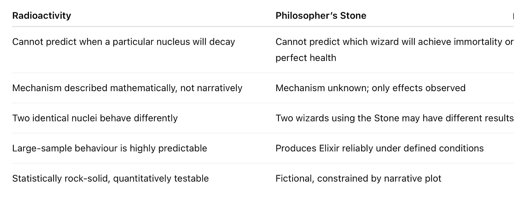
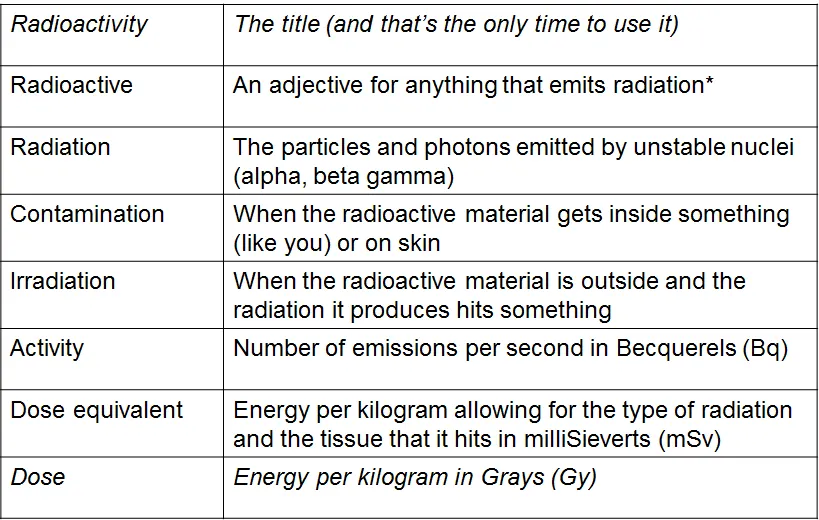
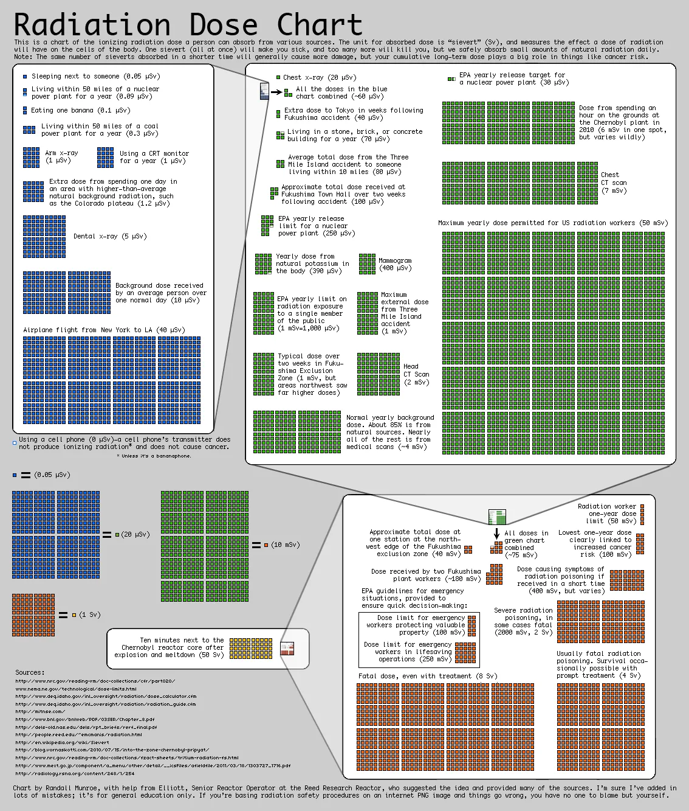

*Episode 1, why radioactivity is magic...*

The origin of this post is almost lost in the mists of time. Years ago, I began helping schools without radioactive sources come up with fun and practical ideas. Over time, these ideas evolved into a CPD session for the IoP, and now they've been resurrected here as a hopefully useful and interesting article.

---

## Why I Love Radioactivity

> "Radioactivity is magic — but it's the kind of magic that obeys maths."

It's the kind of magic any self-respecting wizard-physicist would approve of: unpredictable at the micro level, but completely reliable when you scale up. You don't need Harry Potter or the Philosopher's Stone to find magic — it's all around you in physics.

## Magic at the Microscale

Radioactivity feels magical for several reasons.

**Invisible and mysterious:** You cannot see a nucleus decay with your eyes, yet its effects can be detected with instruments. Each decay happens spontaneously, seemingly without cause.

**Individually unpredictable:** You can't know which nucleus will decay next. This randomness feels like magic because it defies everyday intuition.

**Tiny but powerful:** A single nucleus can release more energy than you might imagine — like a wizard's spell: a small action, huge effect.

---

## But It's Not Magic, Really

Despite appearances, radioactivity is far from fairy tale.

**Statistically precise:** With millions of nuclei, decay follows the **half-life** perfectly. The exponential decay law,

N(t) = N₀e^(−λt)

predicts it with amazing accuracy. Magic rarely obeys such strict rules.

**Observable and testable:** You can measure it, repeat it, and verify it in a lab. Real magic, sadly, doesn't submit to experiments.

---

## Radioactivity vs. the Philosopher's Stone

Radioactivity and the Philosopher's Stone share a curious similarity: mystery at the individual level, reliability at the collective level.

- **Radioactivity:** You cannot predict when a particular nucleus will decay, but large samples behave perfectly according to statistical laws.
- **Philosopher's Stone:** Wizards cannot predict which person will achieve immortality, yet the Stone reliably produces the Elixir of Life under the right conditions.

Of course, the analogy has limits. Radioactivity is **empirically testable, quantitatively predictable, and universally consistent**. The Philosopher's Stone is **fictional and constrained by plot**.

> In short: radioactivity isn't "magic we don't understand" — it's physics governed by probabilistic rules rather than mechanical ones.

---

## What Is Radioactivity, Anyway?

Radioactivity is a natural process in which unstable atomic nuclei release energy by emitting particles or electromagnetic radiation. In simpler terms, some atoms are unstable and spontaneously transform into other atoms, releasing energy.

Because radiation is invisible, it is often feared — and misunderstandings abound. People confuse **irradiation** with **contamination**, or misinterpret **activity** versus **dose**. On top of that there's really not the understanding that there should be that it's a normal part of our world, a spectrum on which some things are almost imperceptibly radioactive, like a banana and some things are horrific like the waste from Chernobyl - more on both of those later - Suffice that the Radiation Protection Division of the Health Protection Agency defines a radioactive substance as having a **specific activity ≥ 400 Bq/kg**. In other words there have to be 400 detectable radioactive events per second, per kilogram of stuff before we even get to call it radioactive.

Here're a few key terms to get straight in your head before launching into teaching:

## Radioactivity All Around You

As I mention, you might be surprised how common it is:

- Humans are naturally radioactive, typically around **7,000 Bq**, though most of it is absorbed within the body.
- **Brazil nuts**, especially those grown in Brazil, can accumulate radium from the soil, making them up to **1,000 times more radioactive than other foods**. Nuts grown elsewhere are usually much less radioactive.

> Radiation is all around us — part of nature, mostly harmless, and secretly magical in its own way.

This is the background map of the uk due to radon gas:

You can see that some areas are more active than others. Even the very active bits are nothing compared to the more radioactive places on Earth:

When talking about radiation, two terms often get confused: **activity** and **exposure**. While they are related, they measure very different things.

## Activity vs Exposure

**Activity** tells us how "radioactive" a source is. More precisely, it measures how many atomic nuclei decay per second. The standard unit is the **becquerel (Bq)**, which equals one decay per second, though older texts sometimes use the **curie (Ci)**. Activity depends only on the **number of unstable nuclei in the source** and how quickly they decay. It does **not** tell you how dangerous the source is or how much radiation you will receive. For example, the human body contains about 7,000 Bq of natural radioactivity from potassium-40 and carbon-14 — enough to make us naturally "radioactive," but not harmful. You can think of activity like the number of sparks flying off a campfire per second: it measures how active the source is, not how much heat or burn you will feel.

**Exposure**, on the other hand, measures how much ionising radiation actually passes through the air and can potentially affect living tissue. Its units include the **coulomb per kilogram (C/kg)** in the SI system, or the **roentgen (R)** in older literature. Exposure depends not just on the source's activity, but also on **distance, shielding, and geometry**. In our campfire analogy, exposure is how many sparks actually hit you. You could stand very close to a small fire and get burnt, or be far from a massive fire and barely notice it.

The relationship between the two is subtle. A source with high activity can produce many radioactive particles, but the exposure you receive depends on how much of that radiation reaches you. Conversely, a device with modest activity can deliver a high exposure if the radiation is focused or close to you. For example, one gram of Uranium-238 has low activity, yet sitting next to it is generally harmless because alpha particles cannot penetrate air. A small medical X-ray machine, however, may have low activity but produces a very high exposure in a focused beam.

In short, **activity measures the source**, while **exposure measures what you actually get**. Understanding the difference is crucial for interpreting radiation safely and accurately, and it also helps demystify why radioactive materials are not inherently dangerous — it all depends on the context and how the radiation interacts with its surroundings.

As always, there's a great XKCD that gives us context;

