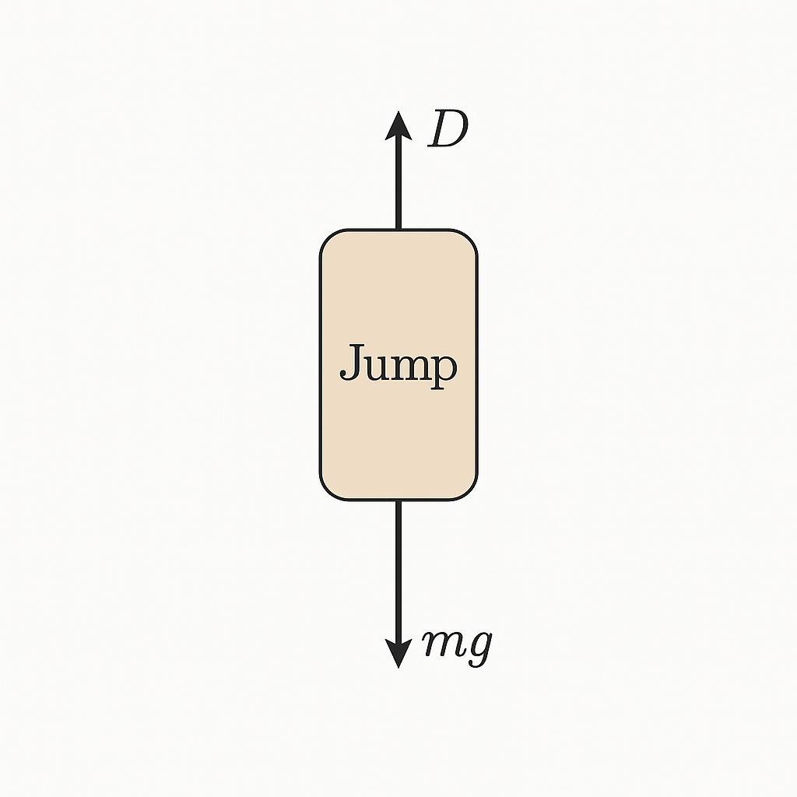

## Freefall from space


In 2012, Felix Baumgartner jumped from the edge of space, plummeting from an altitude of nearly 39,000 meters. During his descent, he accelerated rapidly, eventually breaking the sound barrier before safely deploying his parachute.

<iframe width="800" height="300" src="https://www.youtube.com/embed/E9oKEJ1pXPw" frameborder="0" allow="accelerometer; autoplay; clipboard-write; encrypted-media; gyroscope; picture-in-picture" allowfullscreen>

</iframe>

In this activity, you'll use a computational model to simulate the physics of such a jump. By combining Newton’s laws of motion with the effects of air resistance and changing air density, you'll explore how forces interact during freefall from high altitudes.

You’ll investigate how the jumper’s velocity and acceleration change over time and identify the key point where drag balances gravity—known as terminal velocity. You’ll also reflect on the limitations of the model and how we can improve its accuracy.

By the end, you'll have a better understanding of the complex yet fascinating dynamics of extreme skydiving—and how physics helps us make sense of them.

## Modelling the jump:

The problem can be simply described in a free-body diagram:

{width="234"}

During his free-fall, he was subject to two main forces: gravity

$$
\mathbf{F_g} = mg;
$$

and atmospheric drag\
$$
\mathbf{F_d} = -C \rho(h) A |\mathbf{v}|^2 \hat{v}
$$

Where the drag coefficient $$C \rho(h) A$$ is composed of a constant $$ C $$ depending on the shape of the object, the air density $$ \rho(h) $$ which depends on the height with respect to sea level, and the surface area perpendicular to the direction of motion$ A $.

Assume that Baumgartner + equipment have a mass of 120kg, and that we are on Earth (so $|\mathbf{g}| = 9.81 \text{ m/s}^2$).

We can model the density of the atmosphere as a decaying exponential function:

$$
\rho(h) = \rho_0 e^{-h/H_n}
$$

where $$H_n = 10,400$$ m and $$ \rho{_0} = 1.2 kg/m³.$$

```{r}
# Load libraries
library(ggplot2)
library(gridExtra)

# Parameters
mass <- 120      # kg
massuncert <- 1  # kg
g <- 9.81        # m/s^2
c_1 <- 1.2       # Drag coefficient
rho_0 <- 1.2     # Fluid density at sea level
h_n <- 10400     # Scale height
area <- 1        # Cross-sectional area
dt <- 0.01       # Time step
t <- seq(0, 600, by = dt)

# Initialize vectors
x <- numeric(length(t))
v <- numeric(length(t))
a <- numeric(length(t))
rho <- numeric(length(t))

# Initial conditions
x[1] <- 39000
v[1] <- 0
a[1] <- -g

# Time stepping loop
for (i in 2:length(t)) {
  rho[i] <- rho_0 * exp(-x[i - 1] / h_n)
  a[i] <- -g + c_1 * rho[i] * area * (v[i - 1]^2) / mass
  v[i] <- v[i - 1] + a[i - 1] * dt
  x[i] <- x[i - 1] + v[i - 1] * dt
}

# Create data frame for plotting
df <- data.frame(time = t, altitude = x, velocity = v, acceleration = a)

# Plot using ggplot2
p1 <- ggplot(df, aes(x = time, y = altitude)) +
  geom_line() +
  labs(y = "Altitude (m)", x = NULL) +
  theme_minimal()

p2 <- ggplot(df, aes(x = time, y = velocity)) +
  geom_line() +
  labs(y = "Velocity (m/s)", x = NULL) +
  theme_minimal()

p3 <- ggplot(df, aes(x = time, y = acceleration)) +
  geom_line() +
  labs(y = "Acceleration (m/s^2)", x = "Time (s)") +
  theme_minimal()

# Combine plots
grid.arrange(p1, p2, p3, ncol = 1)

```
