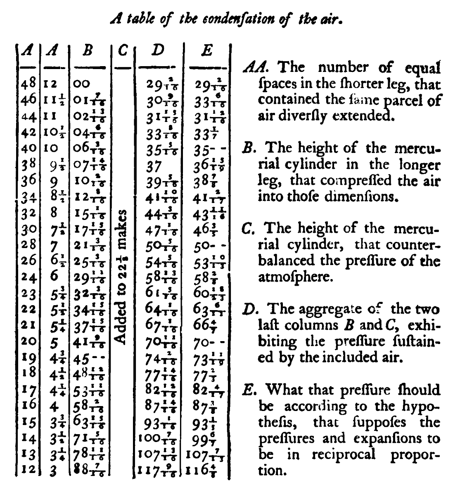

## Theory:

The original presentation of what we know as Boyle’s law has several interesting features. First, the technical difficulties of the experiment were considerable, because Boyle used a glass tube full of mercury that was nearly 2.5 m long, and the large pressures sometimes shattered the glass. Next, Boyle’s table of results contains extremely awkward fractions, such 10/13, 2/17, 13/19, and 18/23, which look very strange to us today. This was because he calculated the pressure for a certain volume of gas by using simple multiplication and division, keeping the vulgar fractions. Boyle was not able to express the numbers as decimals because this notation was not in common use at the time. Finally, his contention that pressure and volume were inversely related depended on the reader’s comparing two sets of numbers in adjacent columns to see how well they agreed. Today we would plot the data, but again orthogonal graphs were not in general use in 1662. When Boyle’s data are plotted by using modern conventional methods, they strongly support his hypothesis that the volume and pressure of a gas are inversely related.

{#fig1}

The figure above shows the original table from his 1662 paper, New Experiments Physico-Mechanical, Touching the Air: Whereunto is Added A Defence of the Authors Explication of the Experiments, Against the Obiections of Franciscus Linus, and, Thomas Hobbes. This was the second edition of a book of almost the same title which had been published two years earlier

Boyle described the experiment in the text accompanying his table, shown in \@ref(fig1)

With considerable difficulty, he procured a glass U tube, the longer leg of which was nearly 8 ft. (2.44 m) long, while the shorter leg was some 12 in. (30.5 cm) long and was sealed at the end. He then prepared a narrow piece of paper, on which he marked 12 in. and their quarters, and he placed this in the shorter limb. A similar piece of paper, again divided into inches and quarters, was placed in the longer limb. Holding the U tube vertically, he then poured mercury into the long limb so that a column of air 12 in. long was trapped in the short limb, and the mercury levels in the two limbs were initially the same. This was the situation represented by the top row of numbers in figure 1.

He then carefully added more mercury, little by little, to the long limb, and he observed the compression of the column of air in the short limb. For example, the second row of the second column of Fig. 1shows that he stopped adding mercury for the second set of readings when the length of the air column was 11 1/2 in.

The third column (B) shows that, at this time, the additional height of the mercury in the longer limb was 1 7/16 in. Additional mercury was then added until the air column was 11 in. high (row 3), at which time the additional height of the mercury in the long column was 2 13/16 in. Although the paper strip in the long limb was only divided into quarters of an inch, Boyle was able to interpolate and measure the height of the mercury to one-quarter of each small division (that is, 1/16 of an inch). In all, Boyle added mercury 24 times, until the length of the column of air was reduced to 3 in. (bottom row, second column A) and the additional height of the mercury was 88 7/16 in. (bottom row, column B).

Boyle added some interesting details on how he carried out this experiment. He had trouble with the breaking of the glass tubes because of the high pressures developed by the long column of mercury, so the lower part of the tube was placed in a square wooden box. This allowed him to catch the valuable mercury. As indicated above, the mercury was poured in very slowly because, as Boyle noted, it was “far easier to pour in more, than to take out any, in case too much at once had been poured in.” The long tube was so tall that the experiment was carried out in a stairwell. Boyle also used a small mirror behind the tube to help him measure the height of the mercury accurately. (aside: this is a great A-level physics trick for reading scales accurately)

As indicated above, the second column of the table (A) and third column (B) show, respectively, the length of the trapped column of air and the additional height of the mercury in the long limb (both in inches). The first column of the table (also headed A) is simply the number of quarter-inches occupied by the trapped air. In other words, it is simply the second column multiplied by 4, and it is proportional to the volume of the gas (assuming a constant cross-sectional area of the tube). In the fourth column, headed C, Boyle states “added to 22 l/8.” This is actually a misprint. The correct value is 29 1/8 in., which Boyle took to be the height of a mercury column supported by the normal atmospheric pressure. Therefore, the fifth column (headed D) is the sum of column B and 29 1/8 in., except that all the fractions in column D are given in 16ths. This column shows the pressure to which the bubble of gas was subjected. The last column (E) is the calculated pressure for the volume shown in the first column (A) according to Boyle’s hypothesis that volume and pressure are inversely related. The fractions are difficult to read and are listed in the Fig. 1 legend.

There are interesting points about Boyle’s table. First, why did Boyle not convert the values to decimals rather than keep the very awkward fractions such as 15/19? As an example, it is not immediately clear to most of us to what extent 107 13/16 differs from 107 7/13. However, if we put these two numbers into a decimal format as 107.813 and 107.538, we can immediately see that the difference between the two is \<0.3%.

The explanation of why Boyle did not use decimal notation is that this was not in general use in 1662. Some notations that bear some resemblance to modern decimals can be found in ancient China and medieval Arabia. Simon Stevin (1548–1620) is often credited with the first use of decimals as we know them today, and these were introduced into England in about 1608. However, it was not until the 18th century that decimal notation become standardized, and, therefore, it is not surprising that Boyle did not make use of decimals.

Another surprising feature for the modern reader about Boyle’s treatment of his data is why he did not plot the results in a graph. One problem with the table shown in Fig. 1 is that the reader has to inspect each row of columns D and E to get a feeling for how much the observed pressures differed from the pressures calculated from the hypothesis. In addition, we need to compare the differences in the top rows with the bottom rows to see if the differences depend on the magnitude of the pressure or volume. Finally, we need to scan the table to make sure that the whole range of pressures/volumes is covered more or less uniformly - Again, the explanation for why Boyle did not plot his data in this way is that graphs to depict data were not in general use in 1662. For example, in “La Geometrie” which René Descartes (1596–1660) wrote as an appendix to his major work of 1637, few orthogonal coordinate systems are used for graphs. In fact, a number of the graphical methods for depicting data that we use today, such as pie charts, were not introduced until the 19th century.

Lets apply a modern treatment to his results:

## Plotting the results:

```{r}
# Load libraries
library(knitr)
library(kableExtra)
library(ggplot2)
library(broom)      # for tidy regression outputs
library(ggpmisc)    # for equation annotation

# === Data ===
Xraw <- c(48,46,44,42,40,38,36,34,32,30,28,26,24,23,22,21,20,19,18,17,16,15,14,13,12)
yraw <- c(29.125,30.563,31.938,33.500,35.313,37.000,39.313,41.625,44.188,47.067,
          50.313,54.313,58.812,61.313,64.063,67.063,70.688,74.125,77.875,
          82.750,87.875,93.0625,100.438,107.813,117.563)

overx <- 1 / Xraw

# === Data frame ===
df <- data.frame(
  Pressure = yraw,
  Volume = Xraw,
  InvVolume = overx
)

# === TABLE OUTPUT ===
kbl(df, format = "html", digits = 2, caption = "Pressure vs Volume and 1/Volume") %>%
  kable_styling("striped", full_width = FALSE)

# === LINEAR MODEL ===
model <- lm(Pressure ~ InvVolume, data = df)
summary(model)

# === TIDY MODEL INFO ===
model_info <- tidy(model)
intercept <- round(model_info$estimate[1], 2)
slope <- round(model_info$estimate[2], 2)
r2 <- round(glance(model)$r.squared, 3)
eqn <- paste0("y = ", slope, "x + ", intercept, "\nR² = ", r2)

# === PLOT ===
ggplot(df, aes(x = InvVolume, y = Pressure)) +
  geom_point(color = "blue", size = 2) +
  geom_smooth(method = "lm", se = FALSE, color = "red") +
  annotate("text", x = min(df$InvVolume), y = max(df$Pressure), 
           label = eqn, hjust = 0, vjust = 1, size = 5, color = "black") +
  labs(
    title = "Pressure vs 1/Volume (Boyle's Law Verification)",
    x = "1 / Volume (arb. units⁻¹)",
    y = "Pressure (in Hg)"
  ) +
  theme_minimal(base_size = 14)

```
